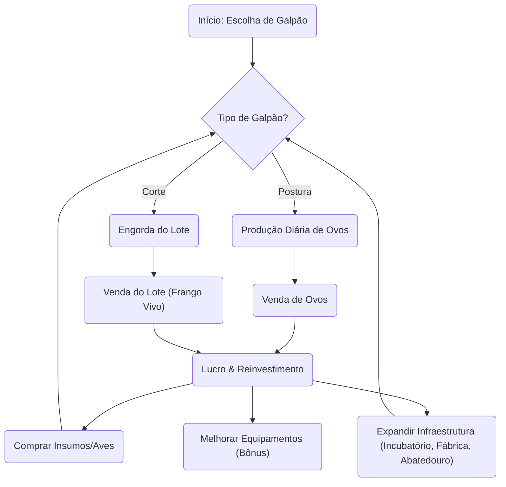

## 1. Visão Geral do Produto
O "Poultry Simulator Beta" (ou Poultry Manager) é um jogo web de gerenciamento e simulação focado na cadeia produtiva da avicultura (frangos de corte e galinhas de postura). Inspirado em jogos como "Airline Manager", o jogo será baseado em textos, imagens fixas, botões, animações básicas e SVGs personalizados, oferecendo uma experiência profunda e realista da vida em uma granja.
- **Objetivo Principal:** Permitir ao jogador gerenciar desde um pequeno galpão até um complexo agroindustrial completo (fábrica de ração, incubatórios, abatedouros), otimizando custos, produção e lidando com variáveis do mundo real (conversão alimentar, mortalidade, doenças sazonais).
- **Público-Alvo:** Fãs de jogos de simulação de negócios, administração e entusiastas do agronegócio.

## 2. Funcionalidades Principais

### 2.1 Módulos de Início (A Escolha do Jogador)
| Opção Inicial | Descrição | Foco Inicial |
|---------------|-----------|--------------|
| Galpão de Postura | Galpão com X galinhas de postura já na fase de produção, pequeno estoque de ração ensacada. | Produzir e vender ovos diariamente. |
| Galpão de Corte | Galpão com X pintinhos de 1 dia, estoque de ração até a retirada do lote. | Engordar frangos para venda (vivo ou para abatedouro) e reiniciar o ciclo. |

### 2.2 Módulos do Jogo (Expansão)
1. **Mercado de Insumos (Ração e Ingredientes):**
   - Compra de ração pronta de fornecedores variados (bônus de menor mortalidade, maior peso, maior produção de ovos).
   - Evolução: Construção de fábrica de ração (compra de milho/soja com preços sazonais, controle de ton/hora, transporte via caminhões, silos graneleiros com capacidades reais).
2. **Genética e Incubação:**
   - Compra de pintinhos de 1 dia de incubatórios terceiros.
   - Evolução: Compra de galinhas matrizes (alta renda) -> produção de ovos férteis -> envio para incubatório próprio (requer máquinas, manutenção periódica, funcionários).
3. **Infraestrutura e Equipamentos:**
   - Compra/expansão de galpões adicionais.
   - Instalação de equipamentos (ventiladores, bebedouros extras, comedouros automáticos) que geram bônus de produção ou redução de mortalidade.
   - Aluguel de granjas (sistema de integração): Custo de aluguel fixo + custos operacionais, mas sem necessidade de construção inicial.
4. **Módulo de Abate (Late Game):**
   - Aquisição de abatedouro (investimento altíssimo) para processar os frangos de corte e maximizar lucros.
5. **Painel de Indicadores (KPIs Reais):**
   - Lucros, Conversão Alimentar (CA), Ganho de Peso Diário (GPD), Mortalidade, Ovos/Dia, % de Eclosão (matrizes).
6. **Eventos Aleatórios:**
   - Doenças sazonais, flutuação de preços de insumos e produtos.

### 2.3 Detalhamento de Páginas
| Nome da Página | Nome do Módulo | Descrição da Funcionalidade |
|----------------|----------------|-----------------------------|
| Dashboard | Resumo da Granja | Exibe KPIs (saldo, dias de jogo, galpões ativos, alertas de doenças/estoque). |
| Meus Galpões | Gestão de Lotes | Lista os galpões (Postura, Corte, Matrizes). Permite ver status do lote, alimentar, coletar ovos, vender lote. |
| Mercado | Loja de Insumos e Aves | Compra de ração (com bônus), pintinhos, galinhas matrizes, venda de ovos/frangos vivos. |
| Infraestrutura | Expansão e Equipamentos | Compra de novos galpões, incubatórios, fábrica de ração, abatedouro e melhorias (ventiladores, etc). |
| Finanças e KPIs | Relatórios | Gráficos e tabelas com CA, GPD, mortalidade histórica, balanço financeiro e controle de aluguéis. |

## 3. Processo Principal
O jogador inicia escolhendo seu caminho (Corte ou Postura). A cada "dia" ou "ciclo" do jogo, os animais consomem ração e geram produtos (peso ou ovos). O jogador deve vender produtos, reabastecer estoques e gerenciar imprevistos para lucrar e expandir o império aviário.

## 4. Design de Interface de Usuário
### 4.1 Estilo de Design
- **Cores Principais:** Tons de verde (natureza/agro), amarelo/laranja (milho/pintinhos/atenção), branco/cinza claro (fundo limpo).
- **Estilo de Botão:** Sólidos com bordas levemente arredondadas, efeitos de hover sutis (estilo dashboard corporativo/jogo de simulação).
- **Fontes e Tamanhos:** Fonte sem serifa moderna (ex: Inter ou Roboto para legibilidade em relatórios), com uma fonte estilizada para os cabeçalhos.
- **Estilo de Layout:** Baseado em cartões (Card-based), menu de navegação lateral ou superior. Foco pesado em tipografia e iconografia SVG limpa.
- **Ícones/Emojis:** Uso de SVGs personalizados (silo, trator, galinha, ovo, saco de ração, cifrão) para representar recursos.

### 4.2 Visão Geral do Design da Página
| Nome da Página | Nome do Módulo | Elementos de UI |
|----------------|----------------|-----------------|
| Dashboard | Resumo da Granja | Cartões de métricas em grade, gráficos de linha simples, painel de alertas no topo. |
| Meus Galpões | Gestão de Lotes | Lista de cartões com barra de progresso (crescimento/idade do lote), botões de ação (Alimentar/Coletar). |
| Mercado | Loja | Lista de itens com ícones SVG, badges destacando "Bônus", inputs numéricos para quantidade, botões de compra. |

### 4.3 Responsividade
Design "Desktop-first", adaptável para dispositivos móveis (Mobile-adaptive), com otimização para toque (Touch optimization) em botões e menus de navegação, visando a facilidade de jogar pelo celular.