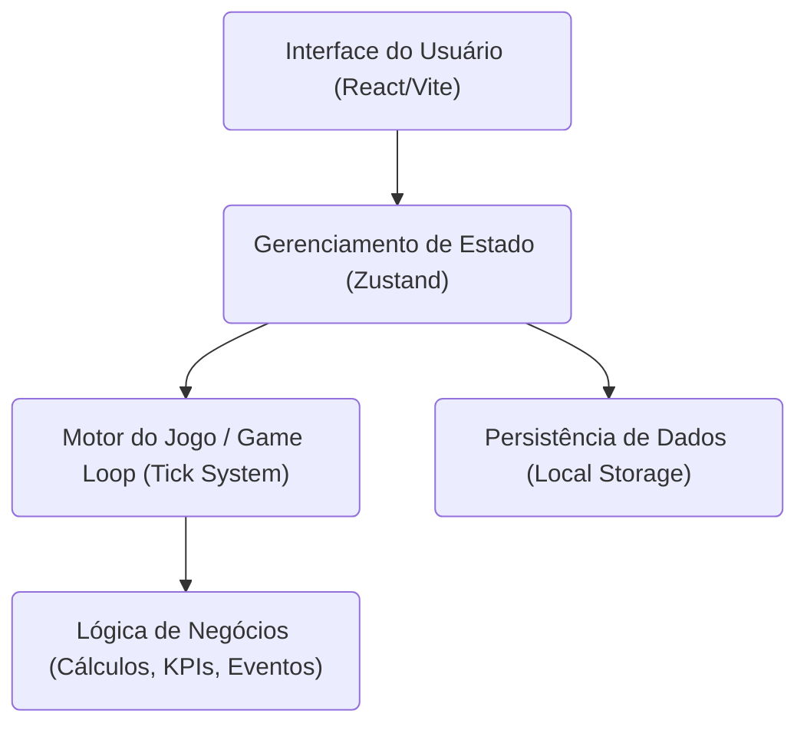
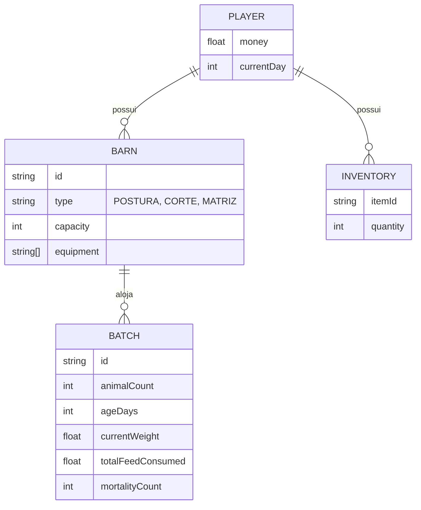

## 1. Desenho da Arquitetura

## 2. Descrição da Tecnologia
- **Frontend:** React@18 + tailwindcss@3 + vite
- **Linguagem:** TypeScript para tipagem rigorosa das entidades (Aves, Galpões, Ração).
- **Gerenciamento de Estado:** Zustand (ideal para gerenciar os múltiplos "stores" do jogo: Estoque, Galpões, Finanças).
- **Ícones/Imagens:** Lucide-react (ou SVGs inline) e Tailwind para animações básicas (CSS-only).
- **Persistência:** LocalStorage (para a versão Beta inicial "standalone").

## 3. Definições de Rotas
| Rota | Propósito |
|------|-----------|
| `/` | Tela de Início / Seleção da Opção Inicial (Postura vs Corte) |
| `/dashboard` | Visão geral, KPIs principais e alertas |
| `/barns` | Gestão detalhada dos galpões e lotes atuais |
| `/market` | Compra de insumos, equipamentos e venda de produtos |
| `/facilities` | Compra e gestão de Fábrica de Ração, Incubatório, Abatedouro |
| `/finance` | Relatórios financeiros detalhados e histórico de lotes |

## 4. Definições de API (Simuladas no Frontend para o Beta)
Como o jogo começará inteiramente no cliente (Web Game standalone), as "APIs" serão funções de serviço que alteram o estado local.
- `buyItem(itemId, quantity, cost)`
- `sellProduct(productId, quantity, price)`
- `advanceTime(days)` -> Dispara o consumo de ração, crescimento, produção de ovos e eventos aleatórios.
- `upgradeBarn(barnId, equipmentId)`

## 5. Modelagem de Dados (Estado Central do Jogo)
### 5.1 Definição do Modelo de Dados

### 5.2 Lógica de Domínio (Entidades Principais)
- **Ração:** Cada tipo tem `{ id, name, costPerKg, bonus: { mortalityModifier, growthModifier, eggModifier } }`.
- **Equipamento:** Cada item tem `{ id, name, cost, effect: { capacityIncrease, mortalityReduction } }`.
- **Eventos:** Sistema de *RNG (Random Number Generator)* a cada "Tick" de tempo para sortear doenças ou mudanças de preço.